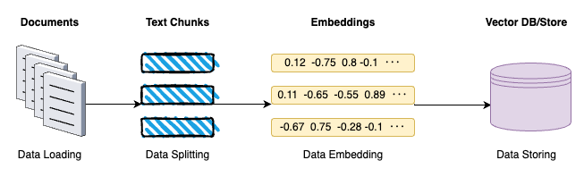
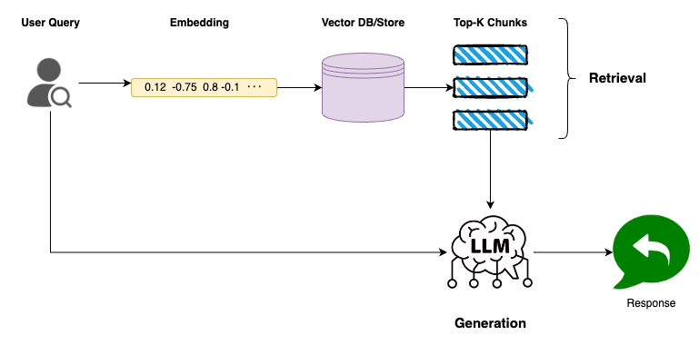
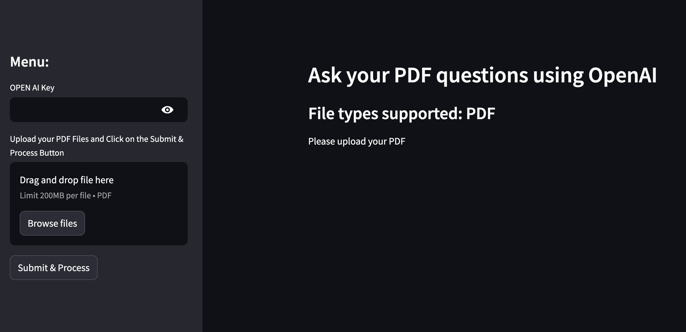
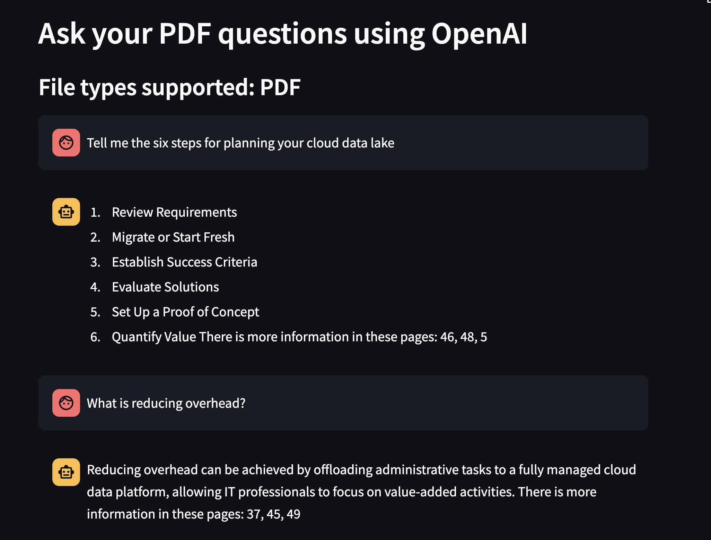

# Interactive PDF Q&A: A Retrieval-Augmented Generation Approach

In the age of information, dealing with huge PDFs is a day-day basis. Most of the times, I have found myself drowning in a sea of text, struggling to find the information that I wanted or needed readings page after page. But, what if I can ask questions about the PDF and recover not only the relevant information but also the page contents.

That's where the **Retrieval-Augmented Generation (RAG)** technique come into play. By combining these cutting-edge technologies, I have created a locally hosted application that allows you to chat with your PDFs, asking uqestions and receving all the necessary context.

Let me walk you through the full process of building this kind of applications!


## What is Retrieval-Augmented Generation (RAG)?

**Retrieval-Augmented Generation** or **RAG** is a method designed to improve the performance of the **LLM** by incorporating extra information of a given topic. This information reduces uncertainty and offers more information helping the model responds to the questions in a better way.

When building a basic **Retrieval-Augmented Generation (RAG)** system, there are two main components to focus on: the areas of **Data Indexing** and **Data Retrieval & Generation**. **Data Indexing** enables the system to store and/or search for documents whenever needed. **Data Retrieval & Generation** is where these indexed documents are queried, the data required is then pulled out and answers generated from this data.

### Data Indexing



**Data Indexing** comprises four key stages:

1. **Data Loading**: This initial stages involes the ingestion of PDFs, audio files, video, etc... into a unified format for the next phases.
2. **Data splitting**: The next step is to divide the content into manegable segments. Segmenting the text into coherent sections or chunks that retain the context and meaning.
3. **Data embeddings**: In this stage, the text chunks are transformed into numerical vectors. This transformation is done using embedding techniques that capture the semantic essence of the content.
4. **Data Storing**: The last step is storing of the generated embeddings which is typically in a vector database or store.


### Data Retrieval & Generation



#### Retrieval

- **Embedding the Query**: Transforming the user’s query into an embedding form so that the latter can be compared for similarity with the document embeddings.
- **Searching the Vector DB**: The vector database or store contains vectors of different chunks of documents. Thus, by comparing this query embedding with the stored ones, the system determines which chunks are the most relevant to the query. Such comparison is often done with the help of computing cosine similarity or any other distance between vectors.
- **Selecting Top-K Chunks**: Based on the similarity scores obtained, the system takes the k-chunks closest to the query embedding.

#### Generation

- **Combining Context and Query**: The top-k chunks provide the necessary context related to the query. When combined with the user's original question, the LLM receives a comprehensive input that will use for generate the output.

Now that we have more context about it, let's jump into the action!

## RAG for PDF Document

### Prerequisites

Everything is described in this [github repository](https://github.com/NachoCP/AskPDF). There is also a docker file there if you wanted to test the full application. I have used the following libraries:

- **Langchain** This serves as the framework for orchestrating the Large Language Models (LLMs). It gives the right instruments and approaches to control and coordinate LLMs should they be applied.
- **PyPDF** Used for loading and processing PDF documents. While PyMuPDF is known for its speed, I have faced several compatibility issues when setting up the Docker environment.
- **FAISS** stands for Facebook AI Similarity Search and is a library used for fast similarity search and clustering of dense vectors. FAISS is also good for fast nearest neighbor search, so its use is perfect when dealing with vector embeddings, as in case with document chunks.
- **Streamlit** Employed for building the user interface of the application. Streamlit allows for rapid development of interactive web applications, making it an excellent choice for creating a seamless user experience.

### Data Indexing

1. Load the PDF document.

```python
from langchain_community.document_loaders import PyPDFLoader

loader = PyPDFLoader(pdf_docs)
pdf_data = loader.load()
```

2. Split it into chunks, I have used chunk size of 1000 characters.

```python
from langchain.text_splitter import CharacterTextSplitter

text_splitter = CharacterTextSplitter(
        separator="\n",
        chunk_size=1000,
        chunk_overlap=150,
        length_function=len
    )
docs = text_splitter.split_documents(pdf_data)
```

3. I have used OpenAI embedding model and loaded them into FAISS vector store.
```python
from langchain_openai import OpenAIEmbeddings
from langchain_community.vectorstores import FAISS

embeddings = OpenAIEmbeddings(api_key = open_ai_key)
db = FAISS.from_documents(docs, embeddings)

```

4. I have configured the retrieval to only the top-3 relevant chunks.
```python

retriever = db.as_retriever(search_kwargs={'k': 3})
```

### Data Retrieval & Generation

1. Using the RetrievalQA chain from Langchain, I have created the full Retrieval & Generation system linking into to the previous FAISS retriever configured.

```python
from langchain.chains import RetrievalQA
from langchain import PromptTemplate
from langchain_openai import ChatOpenAI

model = ChatOpenAI(api_key = open_ai_key)

custom_prompt_template = """Use the following pieces of information to answer the user's question.
If you don't know the answer, just say that you don't know, don't try to make up an answer.

Context: {context}
Question: {question}

Only return the helpful answer below and nothing else.
Helpful answer:
"""

prompt = PromptTemplate(template=custom_prompt_template,
                            input_variables=['context', 'question'])


qa = RetrievalQA.from_chain_type(llm=model,
                            chain_type="stuff",
                            retriever=retriever,
                            return_source_documents=True,
                            chain_type_kwargs={"prompt": prompt})

```

### Streamlit

I have used Streamlit to create an application where you can upload your own documents and start the RAG process with them. The only parameter required is your [OpenAI API Key](https://help.openai.com/en/articles/4936850-where-do-i-find-my-openai-api-key). 



I used the book [Cloud Data Lakes for Dummies](https://www.snowflake.com/resource/cloud-data-lakes-for-dummies/?utm_source=google&utm_medium=paidsearch&utm_campaign=em-es-en-nb-datalakegeneral-phrase&utm_content=go-rsa-evg-eb-cloud-data-lakes-for-dummies&utm_term=c-g-cloud%20data%20lake-p&_bt=600290434268&_bk=cloud%20data%20lake&_bm=p&_bn=g&_bg=128302879383&gclsrc=aw.ds&gad_source=1&gclid=CjwKCAjwm_SzBhAsEiwAXE2CvyvXO7_44hGuWt1_-SUoLwugH6OCxFl_f73ntkIAJnv60PlgYsic3RoClhcQAvD_BwE) as the example for the conversation shown in the following image.



## Conclusion

At a time when information is available in a voluminous form and at users’ disposal, the opportunity to engage in meaningful discussions with documents can go along way in saving time in the process of mining valuable information from large PDF documents. With help of Retrieval-Augmented Generation we are able to filter out the unwanted information and pay attention to the actual information.

This implementation offers a base solution, however the posibilities to optimize it are enormous. It may be possible to further refine aspects such as embedding models, document chunking methods, and retrieval algorithms.

I hope that for you, this article is as fun to read as it was for me to create all of this!